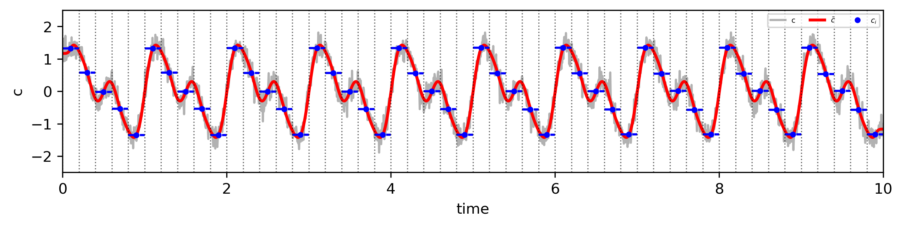
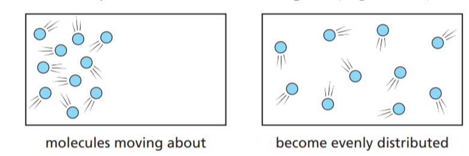

title: 湍流扩散
---

> 混沌系统并不是随机系统。混沌研究的是秩序与随机性之间的过渡 --- 詹姆斯·格雷克

## 1.1 引言

大气的运动会引起污染物浓度在时空上的变化，在空气质量数值模式的语境中，
污染物的湍流扩散是指由风引起，大尺度风场无法直接模拟的那部分污染物浓度变化过程。

\[
\mathbf{u} = \mathbf{u}(x, y, z, t)
\tag {1.1}
\]

风矢量是时空上的连续函数，但数值模式对大气方程进行了离散化，使得风矢量仅在网格点上计算。
离散化后的风矢量（代表某一尺度的风）只能描述一个网格内、某段时间内（即一个时空网格）的平均状态或代表性风场。
\[
\mathbf{u}_{i,j,k}^n = \left(u_{i,j,k}^n, v_{i,j,k}^n, w_{i,j,k}^n\right)
\tag {1.2}
\]

从物理意义上讲，根据质量守恒原理(连续方程)，大气运动是连续发生的。而离散化的风矢量无法准确描述的、
由次网格风引起的污染物浓度再分配，正是湍流扩散所对应的部分。

在风场的雷诺分解 (Reynolds Decomposition) 中，\(u^{'}(x,y,z,t)\) 代表扰动部分（次网格风），
即小尺度、快速变化的风场成分。

\[
\mathbf{u} = \mathbf{u}(x, y, z, t) = \mathbf{u}_{i,j,k}^n + u^{'}(x,y,z,t)
\tag {1.3}
\]

通过对连续方程(一维)进行雷诺分解可得：

\[
\frac{\partial \bar{c}}{\partial t} = 
- \frac{\partial (\bar{c} \bar{u})}{\partial x} - \frac{\partial (\overline{c' u'})}{\partial x} 
\tag {1.4}
\]

其中，**公式 1.4 右边的第二项**即为扩散项（湍流扩散项）的数学表达。
该项描述了湍流对浓度分配的贡献，使得离散化后的连续方程在数学上得以闭合。

<!--  -->

需要注意的是，雷诺分解后的时间平均项代表的是平滑的背景场（时空平滑），依然是一个连续函数。
而数值离散化则可以理解为对雷诺分解后的时间平均项进行离散采样，
即在有限的网格点上近似表示这一连续背景场。

## 1.2 K理论

由于\(u^{'}(x,y,z,t)\)未知，因此需要采用参数化方案来估算扩散项的影响。
在气象学和大气污染扩散研究中，
通常采用一阶涡流粘度方法（k理论、一阶闭合、梯度扩散假设）来求解湍流项，
K理论假设湍流扩散与分子扩散类似，引入了一个湍流扩散系数\(K\)来代替分子扩散系数 \(D\).

为什么能把湍流扩散类比为分子扩散？尽管它们的物理机制和作用范围不同（流体的馄钝性、分子的不规则运动），
这两种扩散机制在物质传输过程中具有一定的相似性。

- 高浓度向低浓度扩散：大气中的湍流扩散和分子扩散的基本原理都是物质在不同浓度梯度下的流动，
最终使得浓度达到均衡。

- 随机性：分子扩散是由分子的热运动引起的随机过程，
而湍流扩散是由气流中的湍流湍动引起的随机过程（在雷诺分解表现为均值为 0 的白噪音）。

<!--  -->

散的速率直观上与物质浓度差以及介质和环境条件（如气压、温度等）密切相关。
根据菲克定律（可以看看[热传导方程](https://www.youtube.com/watch?v=ly4S0oi3Yz8)），
分子扩散的通量公式为：
\[ J = -D_t \frac{\partial c}{\partial x}\]

为了描述湍流导致的浓度演变，引入湍流扩散系数 \(K_t\)（\(m^2s^{-1}\)）， 湍流扩散的通量公式为：
\[\overline{c' u'} \approx -K_t \frac{\partial \bar{c}}{\partial x}\]

需要注意，等式右侧的浓度梯度是通过雷诺分解后的平均项获得的，在后续的公式中，
在后续公式推导中，为了简化表示， \(\bar{c}\) 记作 \(c\)。

为了解决一致性问题（气象模式和空气质量模式的离散方案不同），用混合比 \(C\) 来表示浓度，
\[\overline{C' u'} \approx -K_t \frac{\partial C}{\partial x}\]

其中 \(c = \rho C \)，
假设密度的扰动可以忽略（小尺度空气密度的变化应该远远小于污染物浓度的变化），
也就是 \(\rho' = 0 \)。那么
\[
    \overline{C' u'} \approx \frac{1}{\bar{\rho}} \overline{c' u'}
\]

\[
-K_t \frac{\partial C}{\partial x} = -K_t \frac{\partial (\frac{c}{\rho})}{\partial x} 
\]

因此
\[
 \overline{c' u'} =  -K_t (\rho\frac{\partial (\frac{c}{\rho})}{\partial x})
\]

因此湍流扩散项为:

\[
\frac{\partial c}{\partial t} = -\frac{\partial (\overline{c' u'})}{\partial x} \approx \frac{\partial}{\partial x} \left(K_t (\rho\frac{\partial (\frac{c}{\rho})}{\partial x})\right)
\]

推广到三维情况

\[
\begin{align*}
\frac{\partial c}{\partial t} &=
\frac{\partial}{\partial x} \left(K_x \rho\frac{\partial (\frac{c}{\rho})}{\partial x} \right) \\
\frac{\partial c}{\partial t} &=
\frac{\partial}{\partial y} \left(K_y \rho\frac{\partial (\frac{c}{\rho})}{\partial y} \right) \\
\frac{\partial c}{\partial t} &=
\frac{\partial}{\partial z} \left(K_z \rho\frac{\partial (\frac{c}{\rho})}{\partial z} \right)\\
\end{align*}
\]

对于地球大气而言，水平方向的湍流主要由风速剪切引起，
而垂直方向湍流的强弱受温度梯度和风切变的共同影响，
因此，数值模式通常对水平扩散和垂直扩散分别进行参数化。
